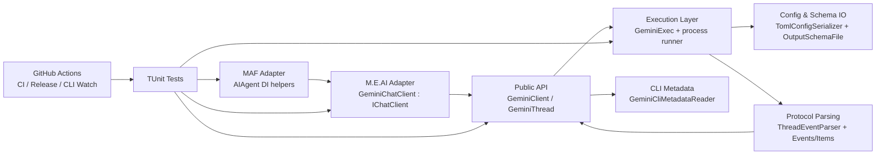
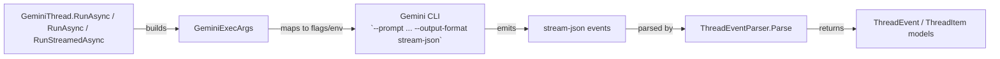
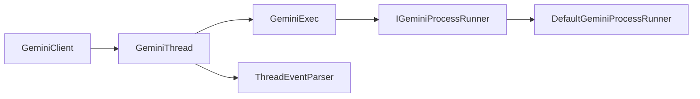

# Architecture Overview

Goal: understand quickly what exists in `ManagedCode.GeminiSharpSDK`, where it lives, and how modules interact.

Single source of truth: this file is navigational and coarse. Detailed behavior lives in `docs/Features/*`. Architectural rationale lives in `docs/ADR/*`.

## Summary

- **System:** .NET SDK wrapper over Gemini CLI JSONL protocol.
- **Where is the code:** core SDK in `GeminiSharpSDK`; optional M.E.AI adapter in `GeminiSharpSDK.Extensions.AI`; optional Microsoft Agent Framework adapter in `GeminiSharpSDK.Extensions.AgentFramework`; tests in `GeminiSharpSDK.Tests`.
- **Entry points:** `GeminiClient`, `GeminiChatClient` (`IChatClient` adapter), `AddGeminiAIAgent` / `AddKeyedGeminiAIAgent` (`AIAgent` DI helpers).
- **Dependencies:** local `gemini` CLI process, `System.Text.Json`, .NET SDK/toolchain, GitHub Actions.

## Scoping (read first)

- **In scope:** SDK API surface, CLI argument mapping, event parsing, thread lifecycle, docs, tests, CI workflows.
- **Out of scope:** Gemini CLI internals (`submodules/google-gemini-cli`), non-.NET SDKs, infrastructure outside this repository.
- Start by mapping the request to a module below, then follow linked feature/ADR docs.

## 1) Diagrams

### 1.1 System / module map

### 1.2 Interfaces / contracts map

### 1.3 Key classes / types map

## 2) Navigation index

### 2.1 Modules

- `Public API` — code: [GeminiClient.cs](../../GeminiSharpSDK/Client/GeminiClient.cs), [GeminiThread.cs](../../GeminiSharpSDK/Client/GeminiThread.cs); docs: [thread-run-flow.md](../Features/thread-run-flow.md)
- `Execution Layer` — code: [GeminiExec.cs](../../GeminiSharpSDK/Execution/GeminiExec.cs), [GeminiExecArgs.cs](../../GeminiSharpSDK/Execution/GeminiExecArgs.cs)
- `Protocol Parsing` — code: [ThreadEventParser.cs](../../GeminiSharpSDK/Internal/ThreadEventParser.cs), [GeminiProtocolConstants.cs](../../GeminiSharpSDK/Internal/GeminiProtocolConstants.cs), [Events.cs](../../GeminiSharpSDK/Models/Events.cs), [Items.cs](../../GeminiSharpSDK/Models/Items.cs)
- `Config & Schema IO` — code: [TomlConfigSerializer.cs](../../GeminiSharpSDK/Internal/TomlConfigSerializer.cs), [OutputSchemaFile.cs](../../GeminiSharpSDK/Internal/OutputSchemaFile.cs), [GeminiOptions.cs](../../GeminiSharpSDK/Configuration/GeminiOptions.cs)
- `CLI Metadata` — code: [GeminiCliMetadataReader.cs](../../GeminiSharpSDK/Internal/GeminiCliMetadataReader.cs), [GeminiCliMetadata.cs](../../GeminiSharpSDK/Models/GeminiCliMetadata.cs); docs: [cli-metadata.md](../Features/cli-metadata.md)
- `CLI Lifecycle` — code: [GeminiCliInstallation.cs](../../GeminiSharpSDK/Internal/GeminiCliInstallation.cs), [CliInstallationProcessRunner.cs](../../GeminiSharpSDK/Internal/CliInstallationProcessRunner.cs), [CliInstallationOptions.cs](../../GeminiSharpSDK/Models/CliInstallationOptions.cs); docs: [cli-metadata.md](../Features/cli-metadata.md)
- `M.E.AI Adapter` — code: [GeminiSharpSDK.Extensions.AI](../../GeminiSharpSDK.Extensions.AI); docs: [meai-integration.md](../Features/meai-integration.md); ADR: [003-microsoft-extensions-ai-integration.md](../ADR/003-microsoft-extensions-ai-integration.md)
- `MAF Adapter` — code: [GeminiSharpSDK.Extensions.AgentFramework](../../GeminiSharpSDK.Extensions.AgentFramework); docs: [agent-framework-integration.md](../Features/agent-framework-integration.md); ADR: [004-microsoft-agent-framework-integration.md](../ADR/004-microsoft-agent-framework-integration.md)
- `Testing` — code: [GeminiSharpSDK.Tests](../../GeminiSharpSDK.Tests); docs: [strategy.md](../Testing/strategy.md)
- `Automation` — workflows: [.github/workflows](../../.github/workflows) (including `real-integration.yml` and `gemini-cli-watch.yml`); docs: [release-and-sync-automation.md](../Features/release-and-sync-automation.md)

### 2.2 Interfaces / contracts

- `Gemini CLI invocation contract` — source: [GeminiExec.cs](../../GeminiSharpSDK/Execution/GeminiExec.cs); producer: `GeminiExec`; consumer: local `gemini` binary; rationale: [001-gemini-cli-wrapper.md](../ADR/001-gemini-cli-wrapper.md)
- `stream-json event contract` — source: [ThreadEventParser.cs](../../GeminiSharpSDK/Internal/ThreadEventParser.cs); producer: Gemini CLI; consumer: `GeminiThread`; rationale: [002-protocol-parsing-and-thread-serialization.md](../ADR/002-protocol-parsing-and-thread-serialization.md)

### 2.3 Key classes / types

- `GeminiClient` — [GeminiClient.cs](../../GeminiSharpSDK/Client/GeminiClient.cs)
- `GeminiThread` — [GeminiThread.cs](../../GeminiSharpSDK/Client/GeminiThread.cs)
- `GeminiExec` — [GeminiExec.cs](../../GeminiSharpSDK/Execution/GeminiExec.cs)
- `ThreadEventParser` — [ThreadEventParser.cs](../../GeminiSharpSDK/Internal/ThreadEventParser.cs)
- `GeminiProtocolConstants` — [GeminiProtocolConstants.cs](../../GeminiSharpSDK/Internal/GeminiProtocolConstants.cs)
- `GeminiCliMetadataReader` — [GeminiCliMetadataReader.cs](../../GeminiSharpSDK/Internal/GeminiCliMetadataReader.cs)

## 3) Dependency rules

- Allowed dependencies:
  - `GeminiSharpSDK.Tests/*` -> `GeminiSharpSDK/*`, `GeminiSharpSDK.Extensions.AI/*`, `GeminiSharpSDK.Extensions.AgentFramework/*`
  - `GeminiSharpSDK.Extensions.AI/*` -> `GeminiSharpSDK/*`
  - `GeminiSharpSDK.Extensions.AgentFramework/*` -> `GeminiSharpSDK.Extensions.AI/*`
  - Public API (`GeminiClient`, `GeminiThread`) -> internal execution/parsing helpers.
- Forbidden dependencies:
  - No dependency from `GeminiSharpSDK/*` to `GeminiSharpSDK.Tests/*`.
  - No dependency from `GeminiSharpSDK/*` to `GeminiSharpSDK.Extensions.AI/*` (adapter is opt-in).
  - No dependency from `GeminiSharpSDK/*` or `GeminiSharpSDK.Extensions.AI/*` to `GeminiSharpSDK.Extensions.AgentFramework/*` (MAF adapter is outermost and opt-in).
  - No runtime dependency on `submodules/google-gemini-cli`; submodule is reference-only.
- Integration style:
  - sync configuration + async process stream consumption (`IAsyncEnumerable<string>`)
  - JSONL event protocol parsing and mapping to strongly-typed C# models.

## 4) Key decisions (ADRs)

- [001-gemini-cli-wrapper.md](../ADR/001-gemini-cli-wrapper.md) — wrap Gemini CLI process as SDK transport.
- [002-protocol-parsing-and-thread-serialization.md](../ADR/002-protocol-parsing-and-thread-serialization.md) — explicit protocol constants and serialized per-thread turn execution.
- [003-microsoft-extensions-ai-integration.md](../ADR/003-microsoft-extensions-ai-integration.md) — IChatClient adapter in separate package.
- [004-microsoft-agent-framework-integration.md](../ADR/004-microsoft-agent-framework-integration.md) — AIAgent adapter layer built on top of the IChatClient package.

## 5) Where to go next

- Features: [docs/Features/](../Features/)
- Decisions: [docs/ADR/](../ADR/)
- Testing: [docs/Testing/strategy.md](../Testing/strategy.md)
- Development setup: [docs/Development/setup.md](../Development/setup.md)
