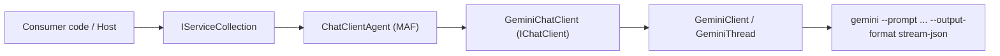

# Feature: Microsoft Agent Framework Integration

Links:
Architecture: [docs/Architecture/Overview.md](../Architecture/Overview.md)
Modules: [GeminiSharpSDK.Extensions.AgentFramework](../../GeminiSharpSDK.Extensions.AgentFramework), [GeminiSharpSDK.Extensions.AI](../../GeminiSharpSDK.Extensions.AI)
ADRs: [004-microsoft-agent-framework-integration.md](../ADR/004-microsoft-agent-framework-integration.md), [003-microsoft-extensions-ai-integration.md](../ADR/003-microsoft-extensions-ai-integration.md)

---

## Implementation plan (step-by-step)

- [x] Analyze current behaviour (facts)
- [x] Finalize spec (rules/flows/diagram/verification)
- [x] Implement the feature (smallest safe increments)
- [x] Add/update automated tests for each scenario (happy + negative + edge)
- [x] Run verification commands (build/test/format/analyze/coverage) and record results
- [x] Update docs (Feature/ADRs/Architecture overview) and close the checklist

---

## Purpose

Enable GeminiSharpSDK consumers to use Microsoft Agent Framework (`AIAgent`) on top of the existing `GeminiChatClient` adapter, with a first-class opt-in package and DI registration helpers that match the repository's adapter-per-boundary approach.

---

## Stakeholders (who needs this to be clear)

| Role | What they need from this spec |
| --- | --- |
| Product / Owner | Clear scope: AIAgent integration is added without changing core Gemini thread/runtime behaviour |
| Engineering | New package boundary, public registration APIs, dependency flow, and tests |
| DevOps / SRE | New optional package dependency only; no new runtime service or credential beyond existing `gemini` CLI login |
| QA | Executable unit-test coverage for non-keyed and keyed agent registration paths |

---

## Scope

### In scope

- New optional package `ManagedCode.GeminiSharpSDK.Extensions.AgentFramework`
- DI helpers `AddGeminiAIAgent()` and `AddKeyedGeminiAIAgent()`
- Composition of `GeminiChatClient` with `Microsoft.Agents.AI` `ChatClientAgent`
- README and docs updates showing direct `AsAIAgent(...)` and DI usage

### Out of scope

- New custom `AIAgent` runtime implementation parallel to `ChatClientAgent`
- Microsoft Agent Framework hosting/workflows helpers (`Microsoft.Agents.AI.Hosting`, durable agents, DevUI)
- Redefining core SDK execution, thread state, parsing, or CLI contracts beyond consuming the already-supported `stream-json` runtime

---

## Business Rules

1. Microsoft Agent Framework integration MUST remain opt-in via a separate package and MUST NOT add a `Microsoft.Agents.AI` dependency to `ManagedCode.GeminiSharpSDK` core or `ManagedCode.GeminiSharpSDK.Extensions.AI`.
2. The integration MUST compose the existing `GeminiChatClient` (`IChatClient`) with the canonical MAF `AsAIAgent(...)` / `ChatClientAgent` path instead of introducing a bespoke agent runtime.
3. `AddGeminiAIAgent()` MUST register both `IChatClient` and `AIAgent` so consumers can resolve either abstraction from the same container.
4. `AddKeyedGeminiAIAgent()` MUST register keyed `IChatClient` and keyed `AIAgent` using the same service key.
5. Agent configuration supplied through `ChatClientAgentOptions` MUST flow into the created agent without mutating Gemini-specific chat client defaults.
6. Gemini provider metadata exposed through `ChatClientMetadata` MUST remain available from the agent-resolved chat client.
7. `ManagedCode.GeminiSharpSDK.Extensions.AgentFramework` MUST ship on the same stable version track as the rest of the repository while `Microsoft.Agents.AI` remains stable, and consumer install docs MUST use the regular stable package command.

---

## User Flows

### Primary flows

1. Direct MAF usage over `GeminiChatClient`
   - Actor: Consumer code using `AIAgent`
   - Trigger: `new GeminiChatClient().AsAIAgent(...)`
   - Steps: construct `GeminiChatClient` -> call MAF `AsAIAgent(...)` -> run prompt via `RunAsync`/`RunStreamingAsync`
   - Result: standard `AIAgent` backed by Gemini CLI through the existing `IChatClient` adapter

2. DI registration
   - Actor: ASP.NET / worker / console host using `IServiceCollection`
   - Trigger: `services.AddGeminiAIAgent(...)`
   - Steps: register `GeminiChatClient` -> create `ChatClientAgent` with configured options -> resolve `AIAgent`
   - Result: one-line registration for MAF consumers

3. Keyed DI registration
   - Actor: Multi-agent / multi-provider host
   - Trigger: `services.AddKeyedGeminiAIAgent("gemini-main", ...)`
   - Steps: register keyed `IChatClient` -> create keyed `AIAgent` -> resolve by key
   - Result: keyed Gemini-backed agents coexist with other providers in the same DI container

### Edge cases

- Null `IServiceCollection` or null keyed service key -> throw argument exceptions from the registration layer
- Missing `ChatClientAgentOptions` configuration -> registration still succeeds with default `ChatClientAgent`
- MAF middleware decoration wraps the underlying chat client -> Gemini metadata must still be discoverable via the resolved agent chat client

---

## System Behaviour

- Entry points: `GeminiAgentServiceCollectionExtensions.AddGeminiAIAgent`, `GeminiAgentServiceCollectionExtensions.AddKeyedGeminiAIAgent`
- Reads from: `GeminiChatClientOptions`, `ChatClientAgentOptions`, DI `ILoggerFactory`
- Writes to: DI service collection only
- Side effects / emitted events: creates singleton `GeminiChatClient` and singleton/keyed `ChatClientAgent`
- Idempotency: follows standard DI additive registration semantics; repeated registration adds additional descriptors
- Error handling: null guard exceptions on registration inputs; runtime agent execution errors are delegated to existing `GeminiChatClient` / MAF behaviour
- CLI specificity: the agent layer inherits the current Gemini headless contract (`--prompt ... --output-format stream-json`) through `GeminiChatClient`; this package does not introduce a second transport model
- Security / permissions: no new permissions beyond existing `gemini` CLI prerequisites; MAF function invocation remains opt-in through consumer-supplied tools/options
- Feature flags / toggles: none
- Performance / SLAs: registration-time object construction only; no extra background work
- Observability: MAF logger factory is passed into `ChatClientAgent`, preserving standard MAF logging hooks

---

## Diagrams

---

## Verification

### Test environment

- Environment / stack: local .NET 10 SDK with restored NuGet dependencies
- Data and reset strategy: DI-only unit tests, no persistent state
- External dependencies: none for focused tests; full solution test run still depends on local `gemini` CLI environment

### Test commands

- build: `dotnet build ManagedCode.GeminiSharpSDK.slnx -c Release -warnaserror`
- test: `dotnet test --solution ManagedCode.GeminiSharpSDK.slnx -c Release`
- format: `dotnet format ManagedCode.GeminiSharpSDK.slnx`
- coverage: `dotnet test --solution ManagedCode.GeminiSharpSDK.slnx -c Release -- --coverage --coverage-output-format cobertura --coverage-output coverage.cobertura.xml`

### Test flows

**Positive scenarios**

| ID | Description | Level (Unit / Int / API / UI) | Expected result | Data / Notes |
| --- | --- | --- | --- | --- |
| POS-001 | `AddGeminiAIAgent()` registers `AIAgent` and `IChatClient` | Unit | Both services resolve and agent-exposed chat client still exposes `GeminiCLI` metadata | `GeminiAgentServiceCollectionExtensionsTests.AddGeminiAIAgent_RegistersAIAgentAndChatClient` |
| POS-002 | Non-keyed agent configuration flows into `ChatClientAgentOptions` and chat metadata | Unit | Agent name, description, instructions, and default model are preserved | `GeminiAgentServiceCollectionExtensionsTests.AddGeminiAIAgent_WithConfiguration_AppliesAgentOptions` |
| POS-003 | Keyed registration resolves keyed `AIAgent` and keyed `IChatClient` | Unit | Both keyed services resolve | `GeminiAgentServiceCollectionExtensionsTests.AddKeyedGeminiAIAgent_RegistersKeyedAgent` |

**Negative scenarios**

| ID | Description | Level (Unit / Int / API / UI) | Expected result | Data / Notes |
| --- | --- | --- | --- | --- |
| NEG-001 | Null service collection | Unit | `ArgumentNullException` for `services` | `GeminiAgentServiceCollectionExtensionsTests.AddGeminiAIAgent_ThrowsForNullServices` |
| NEG-002 | Null keyed service key | Unit | `ArgumentNullException` for `serviceKey` | `GeminiAgentServiceCollectionExtensionsTests.AddKeyedGeminiAIAgent_ThrowsForNullServiceKey` |

**Edge cases**

| ID | Description | Level (Unit / Int / API / UI) | Expected result | Data / Notes |
| --- | --- | --- | --- | --- |
| EDGE-001 | MAF decorates `IChatClient` with middleware | Unit | Agent-resolved chat client still exposes `ChatClientMetadata` with provider `GeminiCLI` | `GeminiAgentServiceCollectionExtensionsTests.AddGeminiAIAgent_RegistersAIAgentAndChatClient`, `AddKeyedGeminiAIAgent_RegistersKeyedAgent` |
| EDGE-002 | Keyed agent configuration preserves instructions and default model | Unit | `ChatClientAgentOptions` and `ChatClientMetadata` reflect configured values | `GeminiAgentServiceCollectionExtensionsTests.AddKeyedGeminiAIAgent_WithConfiguration_AppliesKeyedAgentOptions` |
| EDGE-003 | Agent execution uses the same CLI-specific chat adapter contract as direct `IChatClient` usage | Unit | No alternate transport or extra provider abstraction is introduced by the agent layer | covered by DI composition tests over `GeminiChatClient` |

### Test mapping

- Unit tests: `GeminiSharpSDK.Tests/AgentFramework/GeminiAgentServiceCollectionExtensionsTests.cs`
- Static analysis: solution analyzers via `dotnet build ... -warnaserror`

### Non-functional checks

- Observability: MAF registration path accepts `ILoggerFactory` from DI and passes it into `ChatClientAgent`

---

## Definition of Done

- `ManagedCode.GeminiSharpSDK.Extensions.AgentFramework` exists as a separate opt-in package.
- `ManagedCode.GeminiSharpSDK.Extensions.AgentFramework` uses the same stable package version as the rest of the repository while `Microsoft.Agents.AI` remains stable.
- Direct `GeminiChatClient` + `AsAIAgent(...)` usage is documented in `README.md`.
- DI helpers register non-keyed and keyed `AIAgent` instances over Gemini chat clients.
- Automated tests cover happy path and keyed-edge path registration behaviour.
- Architecture overview, feature doc, ADR, and development setup docs reflect the new module boundary.

---

## References

- ADRs: `docs/ADR/003-microsoft-extensions-ai-integration.md`, `docs/ADR/004-microsoft-agent-framework-integration.md`
- Architecture: `docs/Architecture/Overview.md`
- Testing: `docs/Testing/strategy.md`
- External docs: `https://learn.microsoft.com/en-us/agent-framework/agents/providers/github-copilot?pivots=programming-language-csharp`
