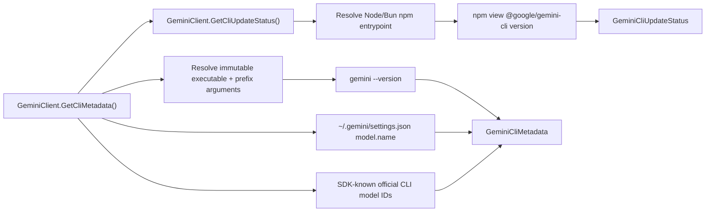

# Feature: Gemini CLI Metadata

Links:
Architecture: [docs/Architecture/Overview.md](../Architecture/Overview.md)
Modules: [GeminiClient.cs](../../GeminiSharpSDK/Client/GeminiClient.cs), [GeminiCliMetadataReader.cs](../../GeminiSharpSDK/Internal/GeminiCliMetadataReader.cs), [GeminiCliMetadata.cs](../../GeminiSharpSDK/Models/GeminiCliMetadata.cs)
Source of truth: local `gemini` CLI + upstream `@google/gemini-cli` package and model catalog

---

## Purpose

The SDK package version mirrors the targeted Gemini CLI version in its first three numeric components and uses the fourth component for an SDK hotfix. `GeminiCliCompatibility.TargetVersion` exposes the exact compatible CLI target without starting a process. `GetCliUpdateStatus()` separately reports the latest version discovered from npm.

Expose runtime Gemini CLI metadata to SDK consumers:

- installed `gemini-cli` version
- default model configured in local Gemini config
- SDK-known model IDs from the official Gemini CLI catalog (not per-account eligibility)
- update availability status vs latest published npm `@google/gemini-cli` version

`GeminiCliMetadata.Models` reports the bundled official CLI catalog plus its documented aliases (`auto`, `pro`, `flash`, `flash-lite`, `auto-gemini-3`, and `auto-gemini-2.5`). The catalog includes stable and preview model IDs and the CLI's supported Gemma 4 IDs, but excludes the retired `gemini-3.1-flash-lite-preview` alias. Static catalog membership does not establish account, experiment, or quota eligibility. Public `GeminiModels` constants remain available for compatibility even when an ID is retired from the current CLI catalog.

---

## Scope

### In scope

- `GeminiClient.GetCliMetadata()` public API.
- `GeminiClient.GetCliUpdateStatus()` public API.
- Reading version from `gemini --version`.
- Reading default model from `~/.gemini/settings.json` (`model.name`) or `$GEMINI_CLI_HOME/.gemini/settings.json`.
- Reporting SDK-known model identifiers from the official Gemini CLI catalog; runtime account availability remains a CLI concern.
- The retained API-only `IsApiSupported` metadata property is false for these native CLI catalog records because the CLI catalog does not establish Gemini API support or account entitlement; consumers must not use it as a CLI admission signal.
- Reading latest published package version from `npm view @google/gemini-cli version`.
- Returning package-manager-appropriate update command (`bun` or `npm`) in update status.

### Out of scope

- Remote model discovery over network APIs.
- Mutating user Gemini config files.
- Replacing Gemini CLI model selection logic.

---

## Business Rules

- Metadata read is read-only and does not mutate local Gemini state.
- If thread-level web search settings are not specified, SDK does not emit `web_search` overrides.
- SDK option and metadata decisions are based on real Gemini CLI behavior, not TypeScript SDK surface.
- Update check failures (for example missing `npm`) must return actionable status messages and never silently fail.
- Update command text must not assume npm-only installs; SDK must emit `bun` update command when bun-managed install is detected.
- Metadata probes use the configured environment policy and `GeminiOptions.CliMetadataProbeTimeout` plus `GeminiOptions.CliMetadataMaximumOutputCharacters`; stdout and stderr drain concurrently, over-cap output fails explicitly, and timeout cleanup confirms root-process exit.
- CLI metadata uses the same immutable `CliLaunchCommand` resolver as model execution. Windows npm `.cmd` wrappers are not executed: only the selected wrapper's adjacent known-package manifest, bounded by `GeminiOptions.CliMetadataMaximumFileCharacters`, can resolve an in-package JavaScript entrypoint (through absolute Node/Bun) or native `.exe`/`.com`. The npm update probe follows the same rule for the selected `npm.cmd`; unknown or malformed wrappers fail closed.

## SDK-owned installation

`GeminiClient.InstallOrUpdateCliAsync(CliInstallationOptions, CancellationToken)` installs exactly `GeminiCliCompatibility.TargetVersion` through an explicitly configured npm or Bun package manager. The public API always writes under `LocalApplicationData/ManagedCode/ManagedCode.GeminiSharpSDK/cli`; callers cannot choose another installation root or provide command arguments. npm is launched as the configured absolute Node executable plus the validated `npm-cli.js` entrypoint, and Bun is launched directly with SDK-owned literal arguments.

The options require the package-manager executable, npm entrypoint when applicable, a minimal allowlisted environment, install and termination timeouts, a per-root lock wait, and metadata/output limits. Provider credentials and arbitrary environment variables are rejected. Progress reports only lifecycle stage and stdout/stderr character counts; it never returns package-manager output text. `Installed` is emitted only after the bounded package manifest matches the exact target and the normal CLI resolver returns a verified `CliLaunchCommand`. After root exit, cleanup waits within the configured bound for natural stdout/stderr EOF before aborting readers; failure to confirm EOF or reader cleanup remains an unconfirmed cleanup error. Cancellation, nonzero exit, output overflow, timeout, version mismatch, and unconfirmed cleanup fail the stream.

Pass `CliInstallationResult.LaunchCommand` to `GeminiOptions.LaunchCommand` when constructing the MEAI client. This preserves safe literal prefix arguments such as `node.exe` plus the installed JavaScript entrypoint on Windows.

The root lock serializes install/update operations across processes. An ownership marker prevents reuse of a nonempty directory that was not created by this SDK. The test assembly uses the internal local-application-data-root seam to run real npm child processes inside `tests/.sandbox`; the public API has no root override.

---

## Diagram

---

## Verification

- Unit parsing/update-check coverage: [GeminiCliMetadataReaderTests.cs](../../GeminiSharpSDK.Tests/Unit/GeminiCliMetadataReaderTests.cs)
- CLI arg behavior: [GeminiExecTests.cs](../../GeminiSharpSDK.Tests/Unit/GeminiExecTests.cs)
- Isolated install/update process behavior: [CliInstallationTests.cs](../../GeminiSharpSDK.Tests/Unit/CliInstallationTests.cs)
