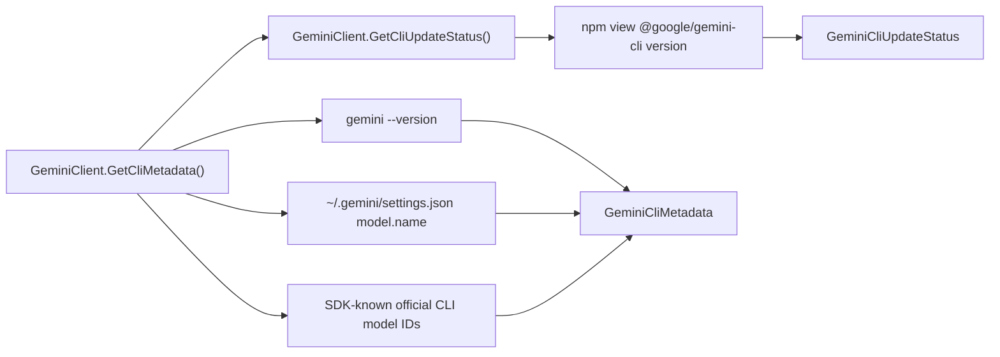

# Feature: Gemini CLI Metadata

Links:
Architecture: [docs/Architecture/Overview.md](../Architecture/Overview.md)
Modules: [GeminiClient.cs](../../GeminiSharpSDK/Client/GeminiClient.cs), [GeminiCliMetadataReader.cs](../../GeminiSharpSDK/Internal/GeminiCliMetadataReader.cs), [GeminiCliMetadata.cs](../../GeminiSharpSDK/Models/GeminiCliMetadata.cs)
Source of truth: local `gemini` CLI + upstream `@google/gemini-cli` package and model catalog

---

## Purpose

Expose runtime Gemini CLI metadata to SDK consumers:

- installed `gemini-cli` version
- default model configured in local Gemini config
- SDK-known model IDs from the official Gemini CLI catalog (not per-account eligibility)
- update availability status vs latest published npm `@google/gemini-cli` version

The public `GeminiModels` constants track model IDs in the bundled official Gemini CLI catalog. They include the stable `gemini-3.5-flash` and `gemini-3.1-flash-lite` choices, the newer access-gated `gemini-3.8-flash` and `gemini-3.5-flash-lite` choices, preview models, and the CLI's supported Gemma 4 IDs. Availability of gated or preview IDs still depends on the user's Gemini CLI account and configuration.

---

## Scope

### In scope

- `GeminiClient.GetCliMetadata()` public API.
- `GeminiClient.GetCliUpdateStatus()` public API.
- Reading version from `gemini --version`.
- Reading default model from `~/.gemini/settings.json` (`model.name`) or `$GEMINI_CLI_HOME/.gemini/settings.json`.
- Reporting SDK-known model identifiers from the official Gemini CLI catalog; runtime account availability remains a CLI concern.
- The retained API-only `IsApiSupported` metadata property is false for these native CLI catalog records because the CLI catalog does not establish Gemini API support or account entitlement; consumers must not use it as a CLI admission signal.
- Reading latest published package version from `npm view @google/gemini-cli version`.
- Returning package-manager-appropriate update command (`bun` or `npm`) in update status.

### Out of scope

- Remote model discovery over network APIs.
- Mutating user Gemini config files.
- Replacing Gemini CLI model selection logic.

---

## Business Rules

- Metadata read is read-only and does not mutate local Gemini state.
- If thread-level web search settings are not specified, SDK does not emit `web_search` overrides.
- SDK option and metadata decisions are based on real Gemini CLI behavior, not TypeScript SDK surface.
- Update check failures (for example missing `npm`) must return actionable status messages and never silently fail.
- Update command text must not assume npm-only installs; SDK must emit `bun` update command when bun-managed install is detected.
- Metadata probes use the configured environment policy and `GeminiOptions.CliMetadataProbeTimeout` plus `GeminiOptions.CliMetadataMaximumOutputCharacters`; stdout and stderr drain concurrently, over-cap output fails explicitly, and timeout cleanup confirms root-process exit.

---

## Diagram

---

## Verification

- Unit parsing/update-check coverage: [GeminiCliMetadataReaderTests.cs](../../GeminiSharpSDK.Tests/Unit/GeminiCliMetadataReaderTests.cs)
- CLI arg behavior: [GeminiExecTests.cs](../../GeminiSharpSDK.Tests/Unit/GeminiExecTests.cs)
