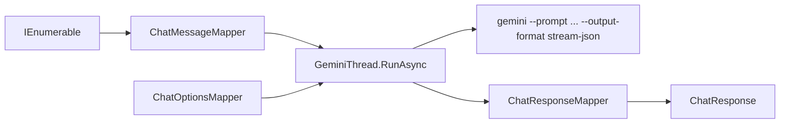

# Feature: Microsoft.Extensions.AI Integration

Links:
Architecture: [docs/Architecture/Overview.md](../Architecture/Overview.md)
Modules: [GeminiChatClient.cs](../../GeminiSharpSDK.Extensions.AI/GeminiChatClient.cs)
ADRs: [003-microsoft-extensions-ai-integration.md](../ADR/003-microsoft-extensions-ai-integration.md)

---

## Purpose

Enable GeminiSharpSDK to participate as a first-class provider in the `Microsoft.Extensions.AI` ecosystem by implementing `IChatClient`, unlocking DI registration, middleware pipelines, and provider-agnostic consumer code.

---

## Scope

### In scope

- `IChatClient` implementation (`GeminiChatClient`) adapting `GeminiClient`/`GeminiThread`
- Input mapping: `ChatMessage[]` → Gemini prompt + images
- Output mapping: `RunResult` → `ChatResponse` with `UsageDetails` and rich content
- Streaming: `ThreadEvent` → `ChatResponseUpdate` mapping
- Custom `AIContent` types for Gemini-specific items (commands, file changes, MCP, web search, collab)
- DI registration via `AddGeminiChatClient()` / `AddKeyedGeminiChatClient()`
- Gemini-specific options via `ChatOptions.AdditionalProperties` with `gemini:*` prefix

### Out of scope

- `IEmbeddingGenerator` (Gemini CLI is not an embedding service)
- `IImageGenerator` (Gemini CLI is not an image generator)
- Consumer-side `AITool` registration (Gemini manages tools internally)
- Generic tuning mappings not exposed by the current headless Gemini CLI contract (for example `Temperature`, `TopP`, `TopK`, and unsupported reasoning flags)

---

## Business Rules

- `ChatOptions.ModelId` maps to `ThreadOptions.Model`.
- `ChatOptions.ConversationId` triggers thread resume via `ResumeThread(id)`.
- Multiple `ChatMessage` entries are concatenated into a single prompt while preserving original message chronology (Gemini CLI is single-prompt-per-turn).
- `ChatOptions.Tools` is silently ignored. Native activity carries fixed `ChatResponseUpdate.AdditionalProperties` categories/phases. Completed command, file-change, MCP, web-search, and collaboration items also retain their existing typed MEAI content for SDK consumers; Prostir consumes only the safe category/phase metadata and does not display raw tool fields.
- `GetService<ChatClientMetadata>()` returns provider name `"GeminiCLI"` with default model from options.
- Streaming maps the real CLI event sequence (`init`, `message`, `tool_use`, `tool_result`, `result`, `error`), not token-level deltas. Role `user` messages are prompt echoes and are omitted. The pinned native CLI emits assistant `delta=true` text fragments; they stream directly while a buffer bounded by the configured process-output limit supports matching `AgentMessageItem` snapshots by exact item ID. The pinned CLI source does not emit `delta=false` assistant messages, so the adapter treats any such event as a complete segment and does not infer whole-turn cumulative semantics. Separate item IDs remain separate messages, and conflicting snapshots for the same ID fail closed.
- Completed command, file-change, MCP, web-search, and collaboration items retain their existing typed MEAI `AIContent` and also include bounded fixed-category activity metadata. Started/updated activity events use metadata only. The Prostir consumer uses the safe category and does not display raw native tool fields.
- Unsupported CLI options fail fast when `GeminiThread` cannot express them through the current headless contract.
- Turn failures propagate from CLI `error` events or process/runtime failures as `InvalidOperationException`.

---

## User Flows

### Primary flows

1. Basic chat completion
   - Actor: Consumer code using `IChatClient`
   - Trigger: `client.GetResponseAsync([new ChatMessage(ChatRole.User, "prompt")])`
   - Steps: map messages → create thread → RunAsync → map result
   - Result: `ChatResponse` with text, usage, thread ID as ConversationId

2. Streaming
   - Trigger: `client.GetStreamingResponseAsync(messages)`
   - Steps: map messages → create thread → RunStreamedAsync → stream events as ChatResponseUpdate
   - Result: `IAsyncEnumerable<ChatResponseUpdate>` with incremental content

3. Multi-turn resume
   - Trigger: `client.GetResponseAsync(messages, new ChatOptions { ConversationId = "thread-123" })`
   - Steps: resume thread with ID → RunAsync → map result
   - Result: Continuation in existing Gemini conversation

---

## Repository Additions (baseline: `bc11f2f2a7d546f34155d88a4800095be840921a`)

### Projects added to solution

- `GeminiSharpSDK.Extensions.AI/GeminiSharpSDK.Extensions.AI.csproj`
  - `ManagedCode.GeminiSharpSDK.Extensions.AI` package
  - `IChatClient` adapter (`GeminiChatClient`) and DI extensions
- `GeminiSharpSDK.Extensions.AI.Tests/GeminiSharpSDK.Extensions.AI.Tests.csproj`
  - mapper/DI test coverage for M.E.AI integration

### Major artifacts introduced

- Adapter entry points: `GeminiChatClient`, `GeminiChatClientOptions`, `GeminiServiceCollectionExtensions`
- Mapping layer: `ChatMessageMapper`, `ChatOptionsMapper`, `ChatResponseMapper`, `StreamingEventMapper`
- Rich content models: `CommandExecutionContent`, `FileChangeContent`, `McpToolCallContent`, `WebSearchContent`, `CollabToolCallContent`
- Docs: ADR `003` and this feature specification

---

## How to Obtain `IChatClient`

### Option 1: Direct construction

```csharp
using Microsoft.Extensions.AI;
using ManagedCode.GeminiSharpSDK.Extensions.AI;
using ManagedCode.GeminiSharpSDK.Models;

IChatClient client = new GeminiChatClient(new GeminiChatClientOptions
{
    DefaultModel = GeminiModels.Gemini25Pro,
});
```

### Option 2: Standard DI registration

```csharp
using Microsoft.Extensions.AI;
using Microsoft.Extensions.DependencyInjection;
using ManagedCode.GeminiSharpSDK.Extensions.AI.Extensions;
using ManagedCode.GeminiSharpSDK.Models;

var services = new ServiceCollection();
services.AddGeminiChatClient(options =>
{
    options.DefaultModel = GeminiModels.Gemini25Pro;
});

using var provider = services.BuildServiceProvider();
var chatClient = provider.GetRequiredService<IChatClient>();
```

### Option 3: Keyed DI registration

```csharp
using Microsoft.Extensions.AI;
using Microsoft.Extensions.DependencyInjection;
using ManagedCode.GeminiSharpSDK.Extensions.AI.Extensions;
using ManagedCode.GeminiSharpSDK.Models;

var services = new ServiceCollection();
services.AddKeyedGeminiChatClient("gemini-main", options =>
{
    options.DefaultModel = GeminiModels.Gemini25Pro;
});

using var provider = services.BuildServiceProvider();
var keyedClient = provider.GetRequiredKeyedService<IChatClient>("gemini-main");
```

---

## Diagrams



---

## Verification

### Test commands

- build: `dotnet build ManagedCode.GeminiSharpSDK.slnx -c Release -warnaserror`
- test: `dotnet test --solution ManagedCode.GeminiSharpSDK.slnx -c Release`
- format: `dotnet format ManagedCode.GeminiSharpSDK.slnx`

### Test mapping

- Mapper tests: `GeminiSharpSDK.Extensions.AI.Tests/ChatMessageMapperTests.cs`, `ChatOptionsMapperTests.cs`, `ChatResponseMapperTests.cs`, `StreamingEventMapperTests.cs`
- DI tests: `GeminiSharpSDK.Extensions.AI.Tests/GeminiServiceCollectionExtensionsTests.cs`
- Adapter regression tests must stay aligned with the current real CLI event contract and the Agent Framework composition layer.

---

## Definition of Done

Native provider failures stop producing response updates, but the adapter continues consuming and discarding later native events until the core CLI iterator completes naturally. Only then does it emit `CliExecutionFailureException` (an `InvalidOperationException` subtype), exposing the CLI exit code when present. `RootProcessExitConfirmed` means the SDK confirmed root-process exit and natural redirected-stream EOF; it does not attest to detached descendants or external effects. Cancellation or uncertain iterator cleanup propagates instead, so no confirmed-failure marker is emitted.

- `GeminiChatClient` implements `IChatClient` with full mapper coverage.
- DI extensions register client correctly.
- All mapper and DI tests pass.
- ADR and feature docs created.
- Architecture overview updated.
