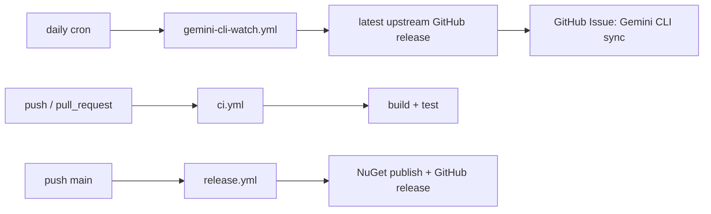

# Feature: Release and Gemini CLI Sync Automation

Links:
Architecture: [docs/Architecture/Overview.md](../Architecture/Overview.md)
Modules: [.github/workflows](../../.github/workflows)
ADRs: [001-gemini-cli-wrapper.md](../ADR/001-gemini-cli-wrapper.md)

---

## Purpose

Keep package quality and upstream Gemini CLI parity automatically verified through GitHub workflows.

---

## Scope

### In scope

- CI workflow (`ci.yml`)
- release workflow (`release.yml`)
- CodeQL workflow (`codeql.yml`)
- upstream watch workflow (`gemini-cli-watch.yml`)
- real integration matrix workflow (`real-integration.yml`)

### Out of scope

- external deployment environments
- branch protection settings configured outside repository

---

## Business Rules

- CI must run build and tests on every push/PR.
- CI and Release workflows must execute full solution tests before smoke subsets, excluding auth-required tests with `-- --treenode-filter "/*/*/*/*[RequiresGeminiAuth!=true]"`.
- CI, Release, and scheduled smoke workflows must install Gemini CLI in a way that remains resolvable by later `dotnet test` steps (for example by adding local `node_modules/.bin` to `PATH`).
- Windows workflows that checkout recursive submodules must enable Git long paths before `actions/checkout`, otherwise upstream Gemini snapshot files can break checkout.
- Gemini CLI smoke test workflow steps must run `GeminiCli_Smoke_*` via `GeminiSharpSDK.Tests` project scope to avoid false `zero tests ran` failures in non-smoke test assemblies.
- Gemini CLI smoke validation must cover both `gemini --help` and headless `gemini --prompt ... --output-format stream-json`, proving root and non-interactive surfaces stay discoverable.
- Release workflow must build/test before pack/publish.
- Release workflow must read package version from `Directory.Build.props`.
- Release workflow must validate semantic version format before packaging.
- Release workflow must fail if the produced core `.nupkg` version does not match `Directory.Build.props`.
- Release workflow must pack every packable NuGet project in the repository, not a hand-maintained subset.
- Release workflow must use generated GitHub release notes.
- Release workflow must create/push git tag `v<version>` before publishing GitHub release.
- Gemini CLI watch runs daily and opens issue when a newer upstream `google-gemini/gemini-cli` GitHub release/tag exists beyond the pinned submodule commit.
- Completing a Gemini CLI sync issue must update the pinned `submodules/google-gemini-cli` commit after validation.
- Sync issue body must derive flag changes from CLI source snapshots, model changes from the bundled upstream model catalog (`packages/core/src/config/models.ts` in the current repo layout), and feature changes from `schemas/settings.schema.json` so alerts stay actionable.
- SDK model constants must cover every bundled slug from `submodules/google-gemini-cli/packages/core/src/config/models.ts` whenever upstream Gemini repo sync work updates the pinned submodule.
- Sync issue must assign Copilot by default.
- Duplicate sync issue for the same upstream release tag/SHA is not allowed.

---

## Diagrams

---

## Verification

### Test commands

- `gemini --help`
- `gemini --prompt "Reply exactly with OK" --output-format stream-json`
- `dotnet build ManagedCode.GeminiSharpSDK.slnx -c Release -warnaserror`
- `dotnet test --solution ManagedCode.GeminiSharpSDK.slnx -c Release`
- `dotnet pack ManagedCode.GeminiSharpSDK.slnx -c Release --no-build -o artifacts`

### Workflow mapping

- CI: [ci.yml](../../.github/workflows/ci.yml)
- Release: [release.yml](../../.github/workflows/release.yml)
- CodeQL: [codeql.yml](../../.github/workflows/codeql.yml)
- CLI Watch: [gemini-cli-watch.yml](../../.github/workflows/gemini-cli-watch.yml)
- Real integration matrix: [real-integration.yml](../../.github/workflows/real-integration.yml)

---

## Definition of Done

- Workflows are versioned and valid in repository.
- Local commands match CI commands.
- Daily release-following sync issue automation is configured and documented.
