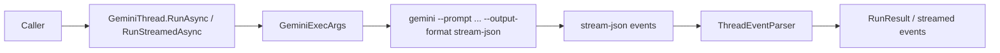

# Feature: GeminiThread Run Flow

Links:
Architecture: [docs/Architecture/Overview.md](../Architecture/Overview.md)
Modules: [GeminiThread.cs](../../GeminiSharpSDK/Client/GeminiThread.cs), [GeminiExec.cs](../../GeminiSharpSDK/Execution/GeminiExec.cs), [ThreadEventParser.cs](../../GeminiSharpSDK/Internal/ThreadEventParser.cs)
ADRs: [001-gemini-cli-wrapper.md](../ADR/001-gemini-cli-wrapper.md), [002-protocol-parsing-and-thread-serialization.md](../ADR/002-protocol-parsing-and-thread-serialization.md)

---

## Purpose

Provide deterministic thread-based execution over Gemini CLI so C# consumers can run turns, stream events, and resume existing conversations safely.

---

## Scope

### In scope

- Turn execution (`RunAsync`, `RunStreamedAsync`) for plain text and structured inputs.
- Conversion of Gemini `stream-json` output into typed `ThreadEvent`/`ThreadItem` models.
- GeminiThread identity tracking across `init.session_id` and `--resume` flows.
- Failure/cancellation handling and structured-output prompt shaping.

### Out of scope

- Network transport reimplementation of Gemini protocol (SDK uses CLI process).
- Multi-thread merge semantics between separate `GeminiThread` instances.

---

## Business Rules

- Only one active turn per `GeminiThread` instance.
- `RunAsync` returns only completed items and latest assistant text as `FinalResponse`.
- `RunAsync<TResponse>` returns `RunResult<TResponse>` with deserialized `TypedResponse`; typed runs require an output schema via either direct `outputSchema` overload parameter or `TurnOptions.OutputSchema`.
- Typed run API supports both concise overloads (`RunAsync<TResponse>(..., outputSchema, ...)`) and full options overloads (`RunAsync<TResponse>(..., turnOptions)`); for AOT-safe typed deserialization pass `JsonTypeInfo<TResponse>`.
- Convenience typed overloads without `JsonTypeInfo<TResponse>` are explicitly marked as AOT-unsafe with `RequiresDynamicCode` and `RequiresUnreferencedCode`.
- Unknown event and item types are surfaced with their original JSON payload instead of terminating the stream parser, so newer Gemini CLI records remain inspectable.
- `result` events with `status=error` must raise `ThreadRunException`.
- Invalid JSONL event lines must fail fast with parse context.
- Protocol tokens are parsed via constants, not inline literals.
- Parser must support the current `init`, `message`, `tool_use`, `tool_result`, `error`, and `result` event envelope, while retaining compatibility with older persisted thread fixtures.
- Usage parsing must accept both legacy `cached` and current `cached_input_tokens` fields so persisted fixtures and newer CLI payloads produce the same `Usage.CachedInputTokens` value.
- `file_change` items may surface before completion with `status=in_progress`; parser must accept in-progress, completed, and failed patch-apply states.
- Optional `ILogger` (`Microsoft.Extensions.Logging`) receives process lifecycle diagnostics (start/success/failure/cancellation).
- Structured output uses typed `StructuredOutputSchema` models that are embedded into the prompt contract and deserialized to typed DTOs; fenced JSON responses are normalized before deserialization.
- `LocalImageInput` accepts image path, `FileInfo`, or `Stream`; stream inputs are materialized to temp files and referenced in the prompt as local `@path` inputs.
- Gemini executable resolution is deterministic: prefer npm-vendored native binary, then PATH lookup; on Windows PATH lookup checks `gemini.exe`, `gemini.cmd`, `gemini.bat`, then `gemini`.
- Thread options map only the current supported headless Gemini CLI flags (`model`, `resume`, `approval-mode`, `include-directories`, sandbox toggle), plus raw `AdditionalCliArguments` passthrough for forward-compatible flags.
- A fresh SDK-started Gemini run with a dedicated working directory persists a resumable session file and is visible through `gemini --list-sessions` for that same project.
- Unsupported legacy headless flags fail fast with actionable `NotSupportedException`.
- Cleanup failures are never silently swallowed; process/schema/image cleanup issues are logged through `ILogger`.

---

## User Flows

### Primary flows

1. Start and run turn
- Actor: SDK consumer
- Trigger: `StartThread().RunAsync(...)`
- Steps: build CLI args -> execute Gemini CLI -> parse stream -> collect result
- Result: `RunResult` with items, usage, final assistant response

2. Start and run typed structured turn
- Actor: SDK consumer
- Trigger: `StartThread().RunAsync<TResponse>(..., outputSchema, ...)` (or `TurnOptions` variant)
- Steps: run regular turn -> deserialize final JSON response to `TResponse` using provided `JsonTypeInfo<TResponse>` when needed
- Result: `RunResult<TResponse>` with typed payload in `TypedResponse`

3. Resume existing thread
- Actor: SDK consumer
- Trigger: `ResumeThread(id).RunAsync(...)`
- Steps: include `--resume <id>` in headless Gemini CLI args -> parse events
- Result: turn executes in existing Gemini conversation

### Edge cases

- Malformed JSON line -> `InvalidOperationException` with raw line context
- `result` event with `status=error` -> `ThreadRunException`
- cancellation token triggered -> execution interrupted and surfaced to caller

---

## Diagrams

---

## Verification

### Test commands

- build: `dotnet build ManagedCode.GeminiSharpSDK.slnx -c Release -warnaserror`
- test: `dotnet test --solution ManagedCode.GeminiSharpSDK.slnx -c Release`
- format: `dotnet format ManagedCode.GeminiSharpSDK.slnx`
- coverage: `dotnet test --solution ManagedCode.GeminiSharpSDK.slnx -c Release -- --coverage --coverage-output-format cobertura --coverage-output coverage.cobertura.xml`

### Test mapping

- GeminiThread behavior: [GeminiThreadTests.cs](../../GeminiSharpSDK.Tests/Unit/GeminiThreadTests.cs)
- Protocol parsing: [ThreadEventParserTests.cs](../../GeminiSharpSDK.Tests/Unit/ThreadEventParserTests.cs)
- CLI argument mapping: [GeminiExecTests.cs](../../GeminiSharpSDK.Tests/Unit/GeminiExecTests.cs)
- Client lifecycle: [GeminiClientTests.cs](../../GeminiSharpSDK.Tests/Unit/GeminiClientTests.cs)
- Real session persistence visibility: [RealGeminiIntegrationTests.cs](../../GeminiSharpSDK.Tests/Integration/RealGeminiIntegrationTests.cs)

---

## Definition of Done

- Public thread APIs stay aligned with current Gemini CLI contracts and documented in repository feature/architecture docs.
- All listed tests pass.
- Typed structured output API keeps explicit AOT-safe (`JsonTypeInfo<TResponse>`) and convenience overload contracts documented and covered by tests.
- Docs remain aligned with code and CI workflows.
